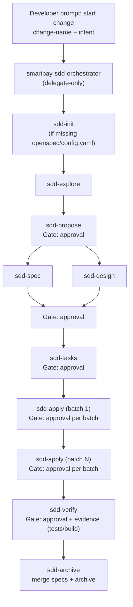

# AI Kit — Install & Usage (SmartPay)

Este repo contiene el **AI Kit** (skills + tools + references) para integrarlo en repos de servicios (microservicios) y/o en workspaces con múltiples repos.

## Project profile (`--project`)

Por defecto el kit asume `--project smartpay`.

SmartPay incluye:
- `smartpay-sdd-orchestrator` (entrypoint SDD por micro)
- `sdd-*` (sub-agents de fases)
- `smartpay-workspace-router` (solo en **workspace root**, no en repos individuales)

## Quick start (1 repo / 1 microservicio)

Desde el root del repo del micro (donde existe `.git`):

## Onboarding (dev nuevo) — primer task con SDD

Objetivo: que un dev nuevo pueda **clonar un micro**, instalar el kit y arrancar una tarea siguiendo SDD.

### 1) Clonar el microservicio

```bash
git clone <repo-del-micro>
cd <repo-del-micro>
```

### 2) Instalar AI Kit (SmartPay por defecto)

```bash
curl -fsSL https://raw.githubusercontent.com/manuelcelyng/prueba-skills-codex/main/install.sh | bash
```

Esto deja el repo con:
- `ai-kit.lock`
- `scripts/ai/*`
- `.ai-kit/` (vendor del kit)
- `.ai/skills/` (proyección efectiva core + overlay local)
- `AGENTS.md` **stub** (si no existía)
- `### Auto-invoke Skills` (generado por `sync`)

### 3) Primer contacto con el repo (AGENTS “real”)

Si el repo quedó con `AGENTS.md` stub (nuevo repo o repo sin guías), en tu primer interacción con la IA:
- Invoca el skill `ai-init-agents` para reemplazar el stub por un `AGENTS.md` completo (tablas + build/test + reglas reales del repo).
- Luego ejecuta `./scripts/ai/sync.sh` para regenerar `### Auto-invoke Skills`.

### 4) Iniciar una tarea usando SDD (SmartPay)

En tu prompt inicial para la IA, usa el entrypoint:
- `smartpay-sdd-orchestrator`

Convención recomendada:
- `change-name`: corto, kebab-case (ej. `add-payment-retry`).

Artefactos SDD (por micro) se escriben en:
- `openspec/config.yaml`
- `openspec/changes/<change-name>/...`

### Flujo SDD (DAG + gates)



### Instalación interactiva (recomendado)

```bash
curl -fsSL https://raw.githubusercontent.com/manuelcelyng/prueba-skills-codex/main/install.sh | bash
```

Durante la instalación podrás elegir qué asistentes configurar (Claude/Gemini/Codex/Copilot).
Por defecto verás todo deseleccionado; si presionas Enter sin seleccionar nada, se configura **Codex**.

### Instalación para SmartPay (SDD) (explícita)

```bash
curl -fsSL https://raw.githubusercontent.com/manuelcelyng/prueba-skills-codex/main/install.sh | bash -s -- --project smartpay
```

### Instalación no interactiva (sin preguntas)

Configurar todos los asistentes:

```bash
curl -fsSL https://raw.githubusercontent.com/manuelcelyng/prueba-skills-codex/main/install.sh | bash -s -- --all
```

Configurar un subconjunto:

```bash
curl -fsSL https://raw.githubusercontent.com/manuelcelyng/prueba-skills-codex/main/install.sh | bash -s -- --claude --codex
```

### Solo instalar archivos (no ejecutar bootstrap/setup/sync)

```bash
curl -fsSL https://raw.githubusercontent.com/manuelcelyng/prueba-skills-codex/main/install.sh | bash -s -- --no-run
```

### Saltar `setup` (no crea symlinks/copias; sí hace sync)

```bash
curl -fsSL https://raw.githubusercontent.com/manuelcelyng/prueba-skills-codex/main/install.sh | bash -s -- --no-setup
```

### Sobrescribir archivos existentes

```bash
curl -fsSL https://raw.githubusercontent.com/manuelcelyng/prueba-skills-codex/main/install.sh | bash -s -- --force
```

## Workspace (múltiples repos)

Desde el root de una carpeta que contenga múltiples repos (subcarpetas con `.git`):

### Instalar en todos (default: Codex only)

```bash
curl -fsSL https://raw.githubusercontent.com/manuelcelyng/prueba-skills-codex/main/workspace-install.sh | bash
```

### Instalar en todos para SmartPay (SDD)

```bash
curl -fsSL https://raw.githubusercontent.com/manuelcelyng/prueba-skills-codex/main/workspace-install.sh | bash -s -- --project smartpay
```

### Elegir asistentes una vez y aplicar a todos

```bash
curl -fsSL https://raw.githubusercontent.com/manuelcelyng/prueba-skills-codex/main/workspace-install.sh | bash -s -- --setup-interactive
```

### Saltar setup en todos

```bash
curl -fsSL https://raw.githubusercontent.com/manuelcelyng/prueba-skills-codex/main/workspace-install.sh | bash -s -- --setup-none
```

### Instalar solo en repos específicos

```bash
curl -fsSL https://raw.githubusercontent.com/manuelcelyng/prueba-skills-codex/main/workspace-install.sh | bash -s -- --repos dispersion,pagos,recepcion
```

## Qué instala / qué genera

En cada repo de microservicio:
- `ai-kit.lock` (apunta a este repo y un ref)
- `scripts/ai/`:
  - `bootstrap.sh` (clona `.ai-kit/` en el repo)
  - `init-agents.sh` (crea un `AGENTS.md` **stub** si falta)
  - `setup.sh` (genera `.ai/skills` y configura `.claude/.gemini/.codex/.github`)
  - `sync.sh` (regenera `### Auto-invoke Skills` en `AGENTS.md`)
  - `create-skill.sh` (scaffold de skills locales en `skills/`)
- `.gitignore` (bloque “AI KIT” para ignorar `.ai-kit/`, `.ai/`, symlinks y archivos generados)

## Filosofía: `AGENTS.md` stub-first

Cuando el repo no tiene `AGENTS.md`, el kit crea un **stub mínimo** con una regla:
invocar el skill `ai-init-agents` para que la IA genere/mejore un `AGENTS.md` completo, específico del repo.

La sección `### Auto-invoke Skills` se gestiona **solo** con `./scripts/ai/sync.sh`.

## Ejecución manual (orden recomendado)

Si prefieres correr los scripts “a mano” (en un repo de microservicio):

1) `./scripts/ai/bootstrap.sh`  
   Descarga/actualiza el kit en `.ai-kit/` según `ai-kit.lock`.

2) `./scripts/ai/init-agents.sh` (solo si no existe `AGENTS.md`)  
   Crea un `AGENTS.md` stub que indica invocar `ai-init-agents` para generar/mejorar las guías del repo.

3) `./scripts/ai/setup.sh [--all|--codex|--claude|--gemini|--copilot]`  
   - Construye `.ai/skills/` (merge core+local).
   - Crea symlinks `.codex/skills`, `.claude/skills`, `.gemini/skills`.
   - Copia `AGENTS.md` → `CLAUDE.md`, `GEMINI.md` y `.github/copilot-instructions.md` cuando aplica.

4) `./scripts/ai/sync.sh`  
   Regenera `### Auto-invoke Skills` en `AGENTS.md` a partir de `metadata.scope` + `metadata.auto_invoke` en cada `SKILL.md`.

Nota: `setup.sh`/`sync.sh` intentan crear `AGENTS.md` automáticamente si falta (vía `init-agents.sh`).

## Scripts (qué hace cada uno)

En este repo (AI Kit):
- `install.sh`: instala el kit en **un repo** (crea `ai-kit.lock`, scripts, `.gitignore`; opcionalmente ejecuta bootstrap/setup/sync).
- `workspace-install.sh`: instala el kit en **múltiples repos** (subcarpetas con `.git`). También puede crear un runner `workspace-ai.sh`.
- `tools/setup.sh`: menú y configuración de asistentes (symlinks/copies). Se usa indirectamente vía `scripts/ai/setup.sh`.
  - `tools/setup.sh --choose-flags`: selección interactiva que imprime flags (uso interno del installer).
- `tools/sync.sh`: genera la tabla Auto-invoke en `AGENTS.md`. Se usa indirectamente vía `scripts/ai/sync.sh`.
- `tools/create-skill.sh`: crea scaffolds de skills (`SKILL.md`) con frontmatter estándar.
- `tools/init-agents.sh`: crea `AGENTS.md` **stub** cuando no existe (primera acción: invocar `ai-init-agents`).
- `tools/build-skills.sh`: arma `.ai/skills` (merge core + overlay local) como symlinks.

En el repo del micro (se instalan en `scripts/ai/`):
- `bootstrap.sh`: crea/actualiza `.ai-kit/`.
- `init-agents.sh`: crea `AGENTS.md` si falta.
- `setup.sh`: build + setup assistants.
- `sync.sh`: build + sync auto-invoke.
- `create-skill.sh`: genera `skills/<skill>/SKILL.md`.

## Workspace runner (opcional)

`workspace-install.sh` puede crear un runner `workspace-ai.sh` en el root del workspace para re-sincronizar todo:

```bash
./workspace-ai.sh --all          # default: --codex
./workspace-ai.sh --repos dispersion,pagos --claude
```

### Workspace router (`AGENTS.md` en el workspace root)

Si abres Codex/Claude/Gemini en el workspace root (carpeta contenedora), puede ser útil tener un `AGENTS.md` “router” ahí:

```bash
./workspace-ai.sh --init-agents --project smartpay --codex
```

Esto:
- clona el kit en `./.ai-kit/` (solo en el workspace root),
- proyecta skills en `./.ai/skills/`,
- configura el asistente elegido (symlinks/copies),
- crea `./AGENTS.md` router,
- y genera `### Auto-invoke Skills`.

### Directorios clave en el repo del micro

- `.ai-kit/`: clone del AI Kit (vendor).
- `.ai/skills/`: **proyección efectiva** (merge de `.ai-kit/skills/*` + `./skills/*`).
- `.claude/skills`, `.gemini/skills`, `.codex/skills`: symlinks a `.ai/skills`.

## Actualizar skills / auto-invoke

En el repo del micro:

```bash
./scripts/ai/bootstrap.sh
./scripts/ai/setup.sh --all
./scripts/ai/sync.sh
```

## Crear un skill específico del micro

Ejemplo:

```bash
./scripts/ai/create-skill.sh --name smartpay-<micro>-<tema> --auto "<Action>"
./scripts/ai/setup.sh --all
./scripts/ai/sync.sh
```

## SmartPay SDD (resumen)

- Persistencia default por micro: `openspec/` dentro del repo del micro.
- Entry point: `smartpay-sdd-orchestrator` (delegate-only, con gates).
- “Async” aquí significa paralelizar fases que escriben artefactos distintos (ej. `sdd-spec` ∥ `sdd-design`), no watchers.
